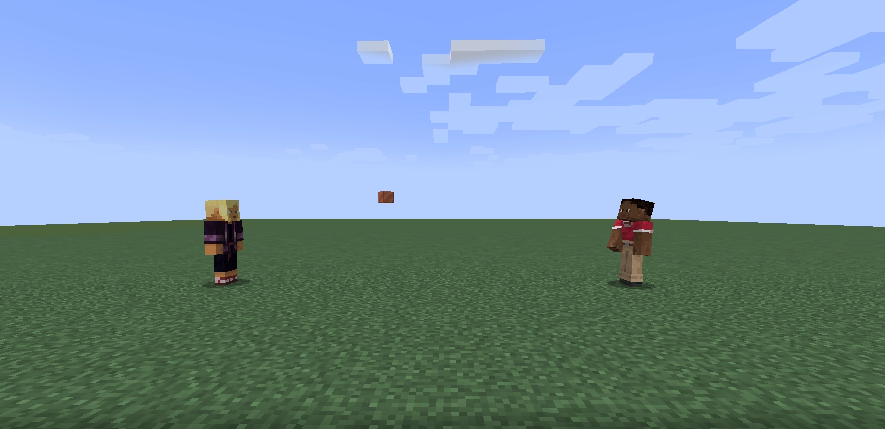

# Yeet!

Yeet is a very simple mod about throwing things.

Yeet allows you to hold down the drop key (default Q) to wind up your arm.
Release it to throw your items farther.

Thrown items can be directly caught by other players.

Friend running low on materials? Just throw them some more!

